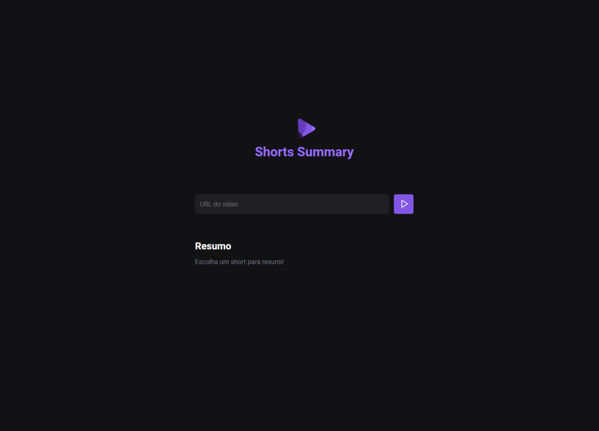

  <a href="#-tecnologias">Tecnologias</a>&nbsp;&nbsp;&nbsp;|&nbsp;&nbsp;&nbsp;
  <a href="#-projeto">Projeto</a>

  

## 🚀 Tecnologias

Esse projeto foi desenvolvido com as seguintes tecnologias:

- HTML
- CSS
- JavaScript
- [`vite`](https://nodejs.org/) - open-source web application framework
- [`phosphor icons`](https://phosphoricons.com/) - free icons
- [`express`](https://expressjs.com/) - minimalist web framework for Node.js
- [`cors`](https://www.npmjs.com/package/cors) - how web pages in one domain can request and interact with resources (such as data, assets, or services) from another domain
- [`axios`](https://axios-http.com/) - making HTTP requests from a web browser or Node.js
- [`ydtl-core`](https://www.npmjs.com/package/ytdl-core) - YouTube downloading module
- [`whisper`](https://openai.com/research/whisper) - automatic speech recognition (ASR) system trained
- [`node-wav`](https://www.npmjs.com/package/wav) - Reader and Writer streams for Microsoft WAVE audio files
- [`ffmpeg`](https://www.npmjs.com/package/ffmpeg) - cross-platform solution to record, convert and stream audio and video.
- [`@xenova/transformers`](https://www.npmjs.com/package/@xenova/transformers) - Machine Learning for the web

## 💻 Projeto

Shorts Summary é uma aplicação web para criar resumo de vídeos shorts do Youtube utilizando Inteligência Artificial para transcrever o conteúdo do vídeo e realizar o resumo do conteúdo. 

